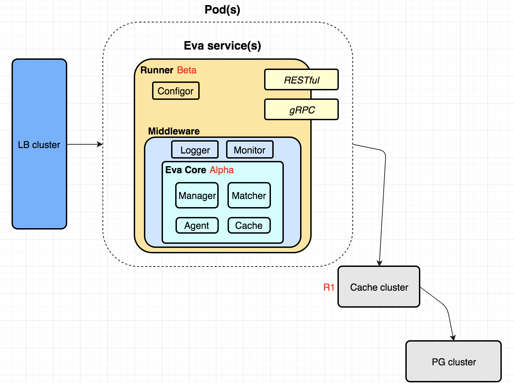

# Eva
Policy-based evaluation service.

[](https://travis-ci.org/6congyao/eva)
<h1 align="center"></h1>

## configure

You need set two envs:  
```bash
# use postgres
EVA_DB_DRIVER=postgres
EVA_DB_SOURCE=postgres://<uname>:<password>@<ip/domain>:5432/<db-name>?sslmode\=disable
# use mysql
EVA_DB_DRIVER=mysql
EVA_DB_SOURCE=<uname>:<password>@tcp\(<ip/domain>:3306\)/<db-name>
export EVA_DB_DRIVER
export EVA_DB_SOURCE
```

## API

### /healthy

Http method: Get
### /evaluation

Http method: Post

Http body: [Request Context](#req-ctx)

## <a name="req-ctx">Request Context
Request context example:
```json
{
  "id": "123",
  "subject": ["qrn:user/max", "qrn:group/dev"],
  "payload": [
    {
      "action": "k8s:list",
      "resource": "k8s:pods"
    },
    {
      "action": "k8s:watch",
      "resource": "k8s:pods/log"
    }
  ]
}
```

## Policy
Policy example:
```json
{
  "Description": "This policy was created for ec2 & s3 service",
  "Version": "2018-5-3",
  "statement": [
    {
      "effect": "allow",
      "action": [
        "ec2:RunInstances",
        "ec2:DescribeInstances"
      ],
      "resource": "*"
    },
    {
      "effect": "allow",
      "action": "s3:GetObject",
      "resource": [
        "qrn:qws:s3:::max/*",
        "qrn:qws:s3:::min/*"
      ]
    }
  ]
}
```

## Response
Response example:

Allow(Http 200):
```json
{
  "from": "Lucas-mbp.local",
  "status": "Allow"
}
```

Default Deny(Http 403):
```json
{
  "decider": null,
  "from": "Lucas-mbp.local",
  "source": {
    "action": "k8s:list",
    "resource": "k8s:podss"
  },
  "status": "request was denied by default (no matching statements)",
  "type": "Default"
}
```

Explicit Deny(Http 403):
```json
{
  "decider": {
    "version": "2018-4-19",
    "description": "This policy denies entity to perform api get* on qstor service at path /bar/*.",
    "statement": [
      {
        "effect": "allow",
        "action": [
          "qstor:Get*"
        ],
        "resource": [
          "qrn:qcs:qstor:::bar/*"
        ]
      },
      {
        "effect": "deny",
        "action": [
          "qstor:Put*"
        ],
        "resource": [
          "qrn:qcs:qstor:::bar/*"
        ]
      }
    ]
  },
  "from": "Lucas-mbp.local",
  "source": {
    "action": "qstor:Put",
    "resource": "qrn:qcs:qstor:::bar/2"
  },
  "status": "request was explicitly denied",
  "type": "Explicit"
}
```
